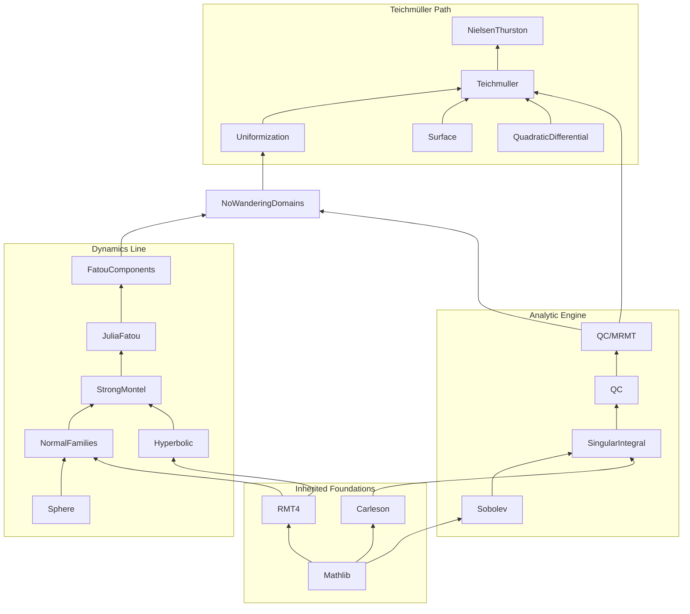

# Complex Dynamics, Teichmüller Theory & Hyperbolic Geometry in Lean 4

A formalization of complex dynamics, Teichmüller theory, and hyperbolic geometry in Lean 4, from the Riemann sphere and normal families through the quasiconformal / Measurable Riemann Mapping engine, working towards complete formalizations of **Sullivan's No Wandering Domains theorem** and the **Nielsen–Thurston classification**. The development follows the first half of McMullen's *Riemann surfaces, dynamics and geometry* lecture notes, building directly on Mathlib and the vendored **RMT4** and **Carleson** projects.

## ⭐ Highlighted theorems

Headline results formalized so far — click to jump to the Lean source:

1. **Schwarz–Pick inequality** — [`schwarzPick`](RiemannDynamics/Hyperbolic/SchwarzPick.lean#L89): a holomorphic self-map of the open unit disk is non-expansive for the Poincaré hyperbolic distance.
2. **Covering property of the triply-punctured sphere by the unit disk** — [`modularLambda_isCoveringMapOn`](RiemannDynamics/Hyperbolic/ModularCoveringMap/CoveringAssembly.lean#L1498): the modular function `λ` is a covering map of `ℂ ∖ {0, 1}` (`= ℂ̂ ∖ {0, 1, ∞}`) from `𝔻`.
3. **Montel–Carathéodory (strong Montel) theorem** — [`montel_caratheodory_sphere`](RiemannDynamics/NormalFamilies/StrongMontel/SphereMontel.lean#L37): a family of sphere-holomorphic maps omitting three fixed values is normal.

## Project Structure


## Architecture

The goal of this project is to work towards the formalization of complex dynamics and Teichmüller theory in Lean, following McMullen's lecture notes. The library is organized around two engineering endpoints with a **shared load-bearing analytic core**: the quasiconformal / Measurable Riemann Mapping engine. Each endpoint is developed independently on top of this core, so that progress on one does not block the other.

### Inherited foundations

The project is a fresh build on top of three mature layers, which are consumed directly rather than re-derived:

1. **Mathlib** — complex analysis (Cauchy theory, `DifferentiableOn ℂ`, locally-uniform limits, Schwarz lemma, Hurwitz), measure / `Lᵖ` machinery, Arzelà–Ascoli, `OnePoint ℂ`, `UpperHalfPlane`, the modular group action, covering-space theory, `FundamentalGroup`.
2. **RMT4 (Beffara), vendored** — the Riemann mapping theorem on simply connected proper open `Ω ⊊ ℂ`, together with the normal-families / Montel / Hurwitz / Schwarz scaffolding it depends on. Parts of the dynamics line are largely *porting and repackaging* RMT4's internal lemmas.
3. **Carleson (van Doorn et al.), vendored** — the two-sided metric Calderón–Zygmund theory developed for the generalized Carleson theorem: the truncated singular-integral operator `czOperator`, two-sided CZ kernels (`IsTwoSidedKernel`), the weak-`(1,1)` theorem `czOperator_weak_1_1`, the Hardy–Littlewood maximal function, and the nontangential maximal operator. The Beurling transform's `Lᵖ` bounds in `SingularIntegral` consume this machinery directly — the Beurling kernel `(z − ζ)⁻²` is registered as a two-sided CZ kernel.

**Non-axioms.** No new `axiom`, no `sorry`. Every result comes from Mathlib, from RMT4, from Carleson, or is proved here.

### Dynamics line — endpoint: Sullivan's No Wandering Domains

The dynamics half is developed directly on the Riemann sphere `ℂ̂ = ℙ¹(ℂ)` with two explicit coordinate charts, and **does not define a general Riemann surface**. The endpoint never consumes the general object, and building it would pull in multi-thousand-line prerequisites (atlas glue, holomorphic-map lemmas, covering-space lifts) that are themselves separate projects. Generality is ascended only when Teichmüller theory genuinely forces it (in the `Uniformization` subfolder).

**Sphere** and **NormalFamilies** provide the dynamical packaging: `ℂ̂` as `OnePoint ℂ` with two explicit charts, the chordal/Fubini–Study metric, rational maps `f = P/Q` extending to `ℂ̂ → ℂ̂`, iterates `f^[n]`, forward / backward / **grand orbits**, the classical Montel theorem (locally uniformly bounded ⇒ normal), and a finite-dimensionality theorem for the parameter space `Ratₐ` of degree-`d` rational maps:

> `theorem rat_d_finiteDim (d : ℕ) : FiniteDimensional ℂ (RatardMapSpace d)`

This is the *contradiction target* for Sullivan.

**Hyperbolic** develops the hyperbolic metric on `𝔻` and `ℍ` (extending Mathlib's `UpperHalfPlane`), the disk automorphism group `mobiusDisk w z = (z − w) / (1 − conj(w) · z)` together with the Möbius automorphism norm identity `‖1 − conj(w) · z‖² − ‖z − w‖² = (1 − ‖z‖²)(1 − ‖w‖²)`, the **Schwarz–Pick** lemma, the **Schwarz Reflection Principle** for holomorphic functions across the real axis (a continuous, real-axis-real, holomorphic-on-the-upper-half function extends by `f(z̄) = f(z)̄` to a holomorphic function on the full symmetric domain), the hyperbolic metric on `ℂ ∖ {0, 1}`, and the **elliptic modular function** `λ : 𝔻 → ℂ ∖ {0, 1}` together with its covering property and monodromy under the level-2 modular group:

> `theorem modularLambda_covering : IsCoveringMap (modularLambda : 𝔻 → ℂ ∖ {0, 1})`

**StrongMontel** combines the previous two: each map in a family `𝓕 : Set (ℂ → ℂ)` omitting the values `0, 1` lifts through `λ` to a `𝔻`-valued map; uniform boundedness in `𝔻` plus classical Montel yields the **Montel–Carathéodory theorem** (omit three values ⇒ normal). Route choice recorded: we take the modular-function lift over Zalcman's rescaling lemma — `λ` is reusable elsewhere (e.g. Picard's theorems as a free corollary).

**JuliaFatou** and **FatouComponents** then assemble the dynamical theory: `FatouSet f` as the normality locus of `{f^[n]}`, `JuliaSet f` as its complement, complete invariance of both under `f`, `J` closed / nonempty / perfect (uses Montel–Carathéodory), `J = closure {repelling periodic points}`, and the periodic-component classification (attracting / parabolic / Siegel / Herman) in the Sullivan-minimal subset.

The dynamics line culminates in:

> **Sullivan's No Wandering Domains** (`RiemannDynamics/Dynamics/NoWanderingDomains.lean`; McMullen, *Riemann surfaces, dynamics and geometry*, Theorem 5.33): for a rational map `f : ℂ̂ → ℂ̂` of degree `≥ 2`, every connected component of `FatouSet f` is eventually periodic.

The proof is the *first end-to-end consumer* of the analytic engine: a wandering component is equipped with an infinite-dimensional family of `f`-invariant Beltrami coefficients, MRMT + analytic dependence (below) produce a holomorphic family of qc conjugacies and hence a holomorphic family of rational maps `f^μ` of fixed degree `d`, and an injective holomorphic map from a polydisk of dimension `> 2d+1` into the `(2d+1)`-dimensional space `Ratₐ` gives the contradiction.

### Analytic engine — quasiconformal maps and MRMT (the shared core)

The engine sits below both endpoints. It is the densest and highest-uncertainty block of the project; the Calderón–Zygmund layer in `SingularIntegral` is the long pole.

**Sobolev** develops the Wirtinger derivatives `∂ = ½(∂ₓ − i∂ᵧ)`, `∂̄ = ½(∂ₓ + i∂ᵧ)`, with the characterization `f` holomorphic ⇔ `∂̄ f = 0`; weak derivatives, `W^{1,p}_loc(ℂ)`, the ACL (absolutely continuous on lines) characterization, and density of `C^∞_c` via mollification.

**SingularIntegral** builds the **Cauchy transform** `Pω(z) = −(1/π) ∫ ω(ζ)/(z − ζ) dA(ζ)` (which solves `∂̄ Pω = ω`), the **Beurling transform** `T = ∂ ∘ P`, the `L²` isometry of `T` via Fourier multipliers, and the Calderón–Zygmund `Lᵖ` bounds with `‖T‖_{Lᵖ→Lᵖ} → 1` as `p → 2`. This last fact is exactly what makes the Neumann series in MRMT converge for every Beltrami coefficient with `‖μ‖∞ < 1`.

**QC** formalizes quasiconformal maps along **two parallel tracks**, with a proven equivalence between them. Each downstream result is stated in whichever formulation is cleanest, and the equivalence lets it transfer:

1. **Analytic track** (the MRMT / Sullivan route): an orientation-preserving homeomorphism `f ∈ W^{1,2}_loc` satisfying the Beltrami equation `∂̄ f = μ · ∂ f` a.e. with `‖μ‖∞ < 1`.
2. **Geometric track**: `K`-quasiconformality via quasi-invariance of the modulus of quadrilaterals. This track owns compactness of normalized families, removability of small sets, and the **Weyl lemma** (`1`-qc ⇒ conformal), where it is significantly cleaner than the analytic track.
3. **Equivalence bridge** (`RiemannDynamics/QC/Equivalence.lean`): the two definitions coincide; the hard direction (geometric ⇒ analytic, i.e. `K`-qc ⇒ `W^{1,2}_loc` + a.e. Beltrami) is a genuine theorem scheduled as its own task.

The engine culminates in the **Measurable Riemann Mapping Theorem (Ahlfors–Bers)** (`RiemannDynamics/QC/MRMT/`; McMullen, *Riemann surfaces, dynamics and geometry*, Theorem 5.27):

> Existence: `theorem mrmt_exists (b : BeltramiCoeff) : ∃ f, IsQCAnalytic f b`, via the Neumann series `f = id + P h`, `h = ∑ₙ (μ · T)^n μ`.
>
> Uniqueness: there is a unique normalized solution fixing `0, 1, ∞` on `ℂ̂`.
>
> **Analytic dependence**: for fixed `z`, the map `t ↦ f^{t·μ}(z)` is holomorphic on `ball 0 (1/‖μ‖∞)`.

The analytic dependence is the lemma both endpoints actually consume — bare existence is not enough.

### Teichmüller path — endpoint: Nielsen–Thurston classification

A focused onward route that reuses the analytic engine. **Generality ascent begins here.** `Uniformization` is where the abstract Riemann-surface structure deferred earlier is finally built — the trichotomy (every simply connected Riemann surface is `≅ 𝔻`, `ℂ`, or `ℂ̂`), the hyperbolic metric on hyperbolic surfaces, and Fuchsian models `X ≅ 𝔻 / Γ` for `Γ ≤ PSL₂(ℝ)`. This is also the natural target for Mathlib integration: the trichotomy and uniformization theorems are statements *about* Mathlib-native objects (`SimplyConnectedSpace`, covering spaces, the upper half plane).

**Surface** develops the topology: closed oriented surfaces classified by genus `g`, the fundamental group presentation `π₁(S_g)` from Mathlib's `FundamentalGroup`, and the mapping class group `MCG(S) := π₀(Homeo⁺(S))` with Dehn twists as generators.

**Teichmuller** assembles the central object: marked Riemann surfaces `(X, φ)` up to isotopy, the Teichmüller space `Teich(S)` as marked complex structures / a Beltrami model `Belt(X) / ∼` (this is where the qc engine is consumed), the **Teichmüller metric** `d_T(X, Y) = ½ inf { log K(ψ) | ψ ≃ marking }`, and the moduli space `M(S) = Teich(S) / MCG(S)`.

**QuadraticDifferential** provides the conformal-geometric machinery: holomorphic quadratic differentials `q dz²` with `L¹` norm, the flat singular metric `|q|^{1/2} |dz|`, horizontal / vertical measured foliations, extremal length of curve families, and **Grötzsch's inequality**.

The Teichmüller path culminates in two theorems:

> **Teichmüller's theorem** (`RiemannDynamics/Teichmuller/Theorem.lean`; McMullen, *Riemann surfaces, dynamics and geometry*, Theorem 4.11): every homotopy class of homeomorphisms `X → Y` between marked Riemann surfaces contains a unique extremal qc map, which is a Teichmüller map — its Beltrami coefficient has the form `μ = k · (q̄ / |q|)` for a quadratic differential `q` and `k < 1`. (Uses MRMT to realize the stretch; uniqueness is the length-area / Grötzsch argument.)
>
> **Nielsen–Thurston classification** (`RiemannDynamics/Teichmuller/NielsenThurston.lean`; McMullen, *Riemann surfaces, dynamics and geometry*, Theorem 4.19): every mapping class `φ ∈ MCG(S)` is periodic, reducible, or pseudo-Anosov.

We take the **Bers route** for Nielsen–Thurston (analysis of the translation length of `φ` acting by isometries on `Teich(S)`) rather than Thurston's measured-foliations / train-tracks route, because Bers chains directly off the Teichmüller metric and existence theorem and reuses no new analytic machinery.

| Subfolder | Description |
|---|---|
| **Sphere** | `ℂ̂ = OnePoint ℂ` with two charts, chordal metric, rational maps, iteration, forward / backward / grand orbits, finite-dimensionality of `Ratₐ`. |
| **NormalFamilies** | Normal families in the locally-uniform topology (Euclidean and spherical), classical Montel via Arzelà–Ascoli. |
| **Hyperbolic** | Hyperbolic metric on `𝔻`, `ℍ`, and `ℂ ∖ {0, 1}`; disk automorphism group `mobiusDisk`; Schwarz–Pick; Schwarz reflection principle; `Γ(2)` fundamental domain; elliptic modular function `λ` and its covering property. |
| **StrongMontel** | Montel–Carathéodory theorem via lift through `λ`; Picard's theorems as corollaries. |
| **JuliaFatou** | Fatou / Julia sets, complete invariance, `J` closed / nonempty / perfect, `J = closure {repelling periodic points}`. |
| **FatouComponents** | Connected components of `FatouSet f`, wandering vs eventually periodic, periodic classification (attracting / parabolic / Siegel / Herman). |
| **Sobolev** | Wirtinger derivatives, `W^{1,p}_loc`, ACL characterization, mollification. |
| **SingularIntegral** | Cauchy transform, Beurling transform, Calderón–Zygmund `Lᵖ` bounds. |
| **QC** | Quasiconformal maps (analytic + geometric definitions with equivalence bridge), composition, compactness, Weyl's lemma, removability. |
| **QC/MRMT** | Measurable Riemann Mapping Theorem: existence via Neumann series, uniqueness, analytic dependence on parameters. |
| **Uniformization** | Trichotomy of simply connected Riemann surfaces; hyperbolic metric on hyperbolic surfaces; Fuchsian models. |
| **Surface** | Classification of closed oriented surfaces, `π₁` presentations, mapping class group. |
| **Teichmuller** | Marked Riemann surfaces, `Teich(S)`, Teichmüller metric, moduli space, Teichmüller's theorem, structure (`Teich(S_g) ≅ ℝ^{6g−6}`). |
| **QuadraticDifferential** | Holomorphic quadratic differentials, horizontal / vertical foliations, extremal length, Grötzsch inequality. |

## Collaborators

- **Will (Ziang) Li** — primary maintainer; design and formalization.
- **Ziyang Qin** — Lean 4 expert; technical guidance on tactic infrastructure, Mathlib idioms, and large-scale proof engineering. (See also Ziyang's [differential geometry library](https://github.com/qinz1yang/differential-geometry).)
- **Yusheng Luo** (Cornell, Department of Mathematics) — mathematical advisor; domain expert in complex dynamics, Teichmüller theory, and hyperbolic geometry.

## FAQ

**Shouldn't this be part of Mathlib?**

Substantial portions of the project are appropriate Mathlib targets and are developed with eventual integration in mind. The natural candidates are everything *below* the Teichmüller path: the strong Montel theorem and Montel–Carathéodory, the modular function `λ` and its covering property, Julia / Fatou theory, the trichotomy half of uniformization, and ultimately **Sullivan's No Wandering Domains theorem** — these are all statements about Mathlib-native objects (`OnePoint ℂ`, `DifferentiableOn ℂ`, `IsCoveringMap`, `SimplyConnectedSpace`) and slot in cleanly. The analytic engine (Sobolev, Beurling transform, qc maps, MRMT) is similarly Mathlib-shaped. The Teichmüller path, being built around the bespoke object `Teich(S)` and the Nielsen–Thurston classification, is more likely to live as a downstream library rather than upstream in Mathlib.

**What's the dependency on existing Lean projects?**

Mathlib (current), the **RMT4** project of Beffara, and the **Carleson** project of van Doorn et al., the latter two vendored as `lake` dependencies on pinned commits. RMT4 provides the Riemann mapping theorem and the normal-families / Montel / Hurwitz / Schwarz scaffolding the dynamics line builds on; Carleson (pinned at `v4.29.0`) provides the two-sided Calderón–Zygmund / weak-`(1,1)` machinery the Beurling transform's `Lᵖ` bounds build on.

**Why concrete `ℂ̂` rather than general Riemann surfaces from the start?**

The dynamics half lives entirely on `ℂ̂ = OnePoint ℂ`. Introducing the general Riemann-surface structure early buys nothing for the endpoint (Sullivan) and pays a large packaging cost — atlas glue, holomorphic-map lemmas, and covering-space lifts are each multi-thousand-line projects. We define `ℂ̂` concretely with two explicit charts and defer abstract Riemann surfaces to the `Uniformization` phase, where Fuchsian models for Teichmüller theory genuinely require them.

**Why two definitions of quasiconformal maps?**

MRMT, the Beltrami equation, and Sullivan's deformation argument all speak the **analytic** language (`μ`, `∂̄ f = μ ∂ f`); compactness, removability, and the "`1`-qc ⇒ conformal" Weyl lemma are far cleaner in the **geometric** language (`K`-qc via modulus). Each downstream qc result is stated in whichever formulation is cleanest, and a one-time equivalence bridge (`RiemannDynamics/QC/Equivalence.lean`) lets it transfer to the other.

**How can I contribute?**

Contributions and suggestions are welcome. Please reach out via email:
- `zl844 {at} cornell [dot] edu`

(all lower case, no symbols)

## AI Disclaimer

Generative AI (Claude) was used in the development of this codebase. The high-level architecture is human-designed; AI agents assisted with formalizing individual proofs and writing boilerplate. All definitions and core theorem statements were human-verified for correctness. Since all proofs are verified by Lean's type checker, AI-generated and human-written code are held to the same standard of correctness. The authors are generally confident about the correctness of the code, but make no guarantees.

## Installation

Ensure you have [Lean 4](https://lean-lang.org/lean4/doc/setup.html) installed.

```bash
# Clone the repository
git clone https://github.com/will1491/RiemannDynamics
cd RiemannDynamics

# Build the library
lake build
```

## References

The abstractions and formalizations in this library are heavily inspired by and built upon the following sources:

- McMullen, C. T. *Riemann surfaces, dynamics and geometry.* Course notes, Harvard University. [Available here.](https://people.math.harvard.edu/~ctm/papers/home/text/class/notes/rs/course.pdf) **(Primary reference.)**
- McMullen, C. T. *Complex Dynamics and Renormalization.* Annals of Mathematics Studies 135, Princeton University Press. (ISBN 978-0-691-02981-8)
- Ahlfors, L. V. *Lectures on Quasiconformal Mappings.* 2nd ed. AMS University Lecture Series 38. (ISBN 978-0-8218-3644-6)
- Hubbard, J. H. *Teichmüller Theory and Applications to Geometry, Topology, and Dynamics*, Vol. 1: Teichmüller Theory. Matrix Editions. (ISBN 978-0-9715766-2-9)
- Farb, B., & Margalit, D. *A Primer on Mapping Class Groups.* Princeton Mathematical Series 49. (ISBN 978-0-691-14794-9)
- Beffara, V. **RMT4**: a formalization of the Riemann mapping theorem in Lean 4. [github.com/vbeffara/RMT4](https://github.com/vbeffara/RMT4)
- van Doorn, F., et al. **Carleson**: a formalization of a generalized Carleson's theorem — and the two-sided metric Calderón–Zygmund theory it develops — in Lean 4. [github.com/fpvandoorn/carleson](https://github.com/fpvandoorn/carleson)
